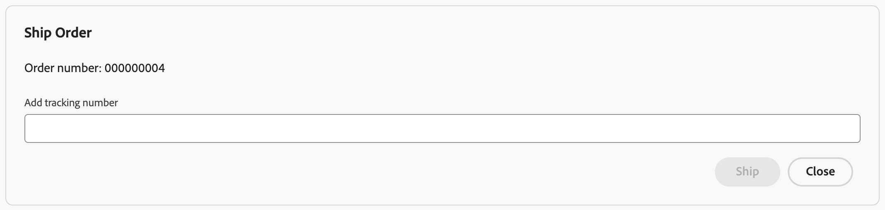

# Commerce Partner Days - ACCS Session

## Pre-Event Setup

These steps should be completed before you arrive to the event.

### Codespaces Setup
 
1. Visit https://github.com/adobe-commerce/partner-day-accs.
2. Navigate to the top right of the page and click on the `Use this Template` button. Select the `Create a new repository` option to create a new repo with the template. 
3. This should launch the repo provisioning UI. Select your personal account as the owner and enter an appropriate name for the repo. Make the repo `Private` and click on `Create Repository` to create a repo from the template. 
4. Congratulations, you now have the tools to create and extend your own commerce store.
5. Click on the `Code` icon and select the `Codespaces` tab. Click on the `+` icon to create a new personal codespace. 
6. This will launch a new codespace on the repo. The initialization will take around 3-4 minutes. 
7. Once done, you will be able to interact with the online IDE. 

## At The Event Setup

### Login to Developer Console

1. Go to the Adobe Developer console: http://developer.adobe.com/console.
        
    The Developer Console is the gateway to access all the services and tooling available as part of the Adobe Developer Ecosystem.

2. Login with the following credentials. You will find your assigned seat number on your desk.
```
Email: pd-bcn1+<SEAT_NUMBER>@adobecreate.com
Password: Check with the lab instructor
```


3. Select `Adobe Commerce Labs` profile.

4. After logging in, accept Terms and Conditions.


### Continue to Configure Codespaces

0. Start the codespace in the repository you cloned under your GitHub account from https://github.com/adobe-commerce/partner-day-accs


1. Navigate to the terminal and run the following command to clear the temporary github token:
```bash
unset GITHUB_TOKEN
```
2. Now let's connect the terminal to your personal Github account. Run the following command:
```bash
gh auth login
```
This should launch the login process. Select the appropriate options to log into your Github account.


Once done you should see the following on the login screen:


3. Now let's connect the terminal to your assigned Adobe IMS account. Run the following command in the terminal:
```bash
aio auth login
```
If you are asked to confirm your action to open an external website, click `Open`.


Since we have logged in earlier, the terminal should be able to pick up the session automatically. **If that did not work, follow the same steps as above to login.**

Once login is successful, you will see a redirect link, click on it.


You will see an error such as this:


No worries, make a note of the port number in the address bar, for instance:


Go to the ports tab next to the terminal in the Codespaces window.


Look for an auto-forwarded port with the same port number as earlier from the error window. Once you identify the appropriate forwarded port, copy it.


Navigate back to the error window and replace `127.0.0.1:<PORT_NUMBER>` with the copied text, and click enter. This will connect the IMS login on the browser to the Codespaces terminal.


You're all done and ready to create a Storefront.

## Create Storefront

Congratulations on creating a codespace and completing the pre-requisite steps. Now comes the fun part. Let's create a storefront and connect it to a Commerce instance using API Mesh.

1. Run the commerce scaffolder CLI
```bash
aio commerce init
```
2. Make sure the CLI has selected the right github account. If so, enter `y`.
3. Enter a name that will be used as the name the storefront repo. Make sure it does not contain underscores and was not used in the past. We also recommend using a short repo name.
4. Select the first template in the list `adobe-commerce/adobe-demo-store`.
5. Select the second option, which will allow us to select an assigned instance `Pick an available Adobe Commerce tenant`.
6. This will prompt us to select the Org. Select the `Adobe Commerce Labs` org and press enter.
7. From the list of instances, select the instance assigned to you. You can search for your instance by typing `Cloud Service <SEAT_NUMBER>`.
8. From the list of projects, select the project assigned to you. You can search for your project by typing `PD BCN1 <SEAT_NUMBER>`.
9. Select the Production workspace.
10. This will connect the selected instance through an API Mesh on the selected Project and Workspace.
11. In the next step if a browser tab isnt opened, go to this link https://github.com/apps/aem-code-sync/installations/select_target.
12. Select the appropriate account to install the AEM Sync Bot and complete the login process, if any.
13. Select the option to only install on selected repositories. Enter the name of the repo from the 3rd step in the dropdown and click save.
14. Go back to the terminal and click enter to move forward. At this point, the CLI will validate the code sync and continue with content cloning. This will take a minute or 2.
15. Congratulations, you have created your own Storefront. Copy the final details and save it for future reference.


## Storefront Walkthrough

1. Go to the preview link from the terminal. It should be something like this `https://main--{repo}--{owner}.aem.page/`
2. Go to a sample PDP page `https://main--{repo}--{owner}.aem.page/products/adobe-for-all-tee/ADB256`

## Mesh Extensibility (Phase 2)

Let's stitch Commerce backend and Ratings API using API Mesh. In this section we will create a new `ratings` field on the Products query and implement it using the Ratings API.

There are 2 options to achieve this:

1. Use a prebuilt mesh config
2. Implement the mesh config changes manually

### 1. Use a Pre-Built Mesh Config

Using the terminal, move to the `lab/mesh` folder.

```bash
cd lab/mesh/
```

Replace `<ACCS_GRAPHQL_URL>` with the `Graphql URL` from the excel spreadsheet into the `mesh_config.json` file on line 22.

That's it, move over to the [deploy section](#deploy-mesh-changes) to continue with the next steps.

### 2.1 Stitch Ratings API with Adobe Commerce Backend

Here is the sample Ratings API to use with the mesh: `https://ratings-api.apimesh-adobe-test.workers.dev`

Let's add the new Ratings API to the Mesh. Open the `mesh_config.json` and add the following config under the sources array. Make sure to add a comma after the Adobe Commerce Backend source that is already listed in the mesh config.

```json
{
  "name": "Ratings",
  "handler": {
    "JsonSchema": {
      "baseUrl": "https://ratings-api.apimesh-adobe-test.workers.dev",
      "operations": [
        {
          "type": "Query",
          "field": "ratings",
          "path": "/",
          "method": "GET",
          "responseSample": "./sampleRatings.json"
        }
      ]
    }
  }
}
```

The above config references a file called `sampleRatings.json`. Let's create this file with the following contents:

```json
{
  "average": 2,
  "total": 807
}
```

For reference, here is the final [sampleRatings.json](./lab/mesh/sampleRatings.json) file.

### 2.2 Define `rating` field on `products` query

At this point we have added the Ratings source to the mesh. Now let's create the `ratings` field on the `products` query. Add the following contents to the `mesh_config.json` file under `meshConfig`:

```json
"additionalTypeDefs": "type Rating { average: Int, total: Int } extend type SimpleProductView { rating: Rating }",
```

### 2.3 Implement `rating` field on `products` query

The above code defined a new type called `Rating` and added it to the `SimpleProductView` under a new field called `rating`. Now lets implement that field using the new Ratings API. Create a new file called `ratingsResolver.js` and add the following contents:

```js
module.exports = {
  resolvers: {
    SimpleProductView: {
      rating: {
        selectionSet: "{sku}",
        resolve: (root, args, context, info) => {
          return context.Ratings.Query.ratings({
            root,
            args,
            context,
            info,
            selectionSet: "{average, total}",
          })
            .then((response) => {
              return response;
            })
            .catch(() => {
              return null;
            });
        },
      },
    },
  },
};
```

Add the resolver file reference to the `meshConfig`:

```json
"additionalResolvers": ["./ratingsResolver.js"],
```

For reference, here are the final [ratingsResolver.js](./lab/mesh/ratingsResolver.js) and [mesh_config.json](./lab/mesh/mesh_config.json) files.

### Deploy mesh changes

Finally, lets deploy the mesh config to publish the new changes:

```bash
aio api-mesh update mesh_config.json
```

This operation typically takes 30 seconds to a minute. To check the status of the update, run the following command:

```bash
aio api-mesh status
```

## Storefront Extensibility

Lets update the storefront to display ratings in PDP pages.

### Storefront Codespace Setup

Go to the new storefront code repo created when `aio commerce init` was run in the terminal (the repo will follow the pattern https://github.com/<user>/<storefrontname>). Use the codespaces setup instructions from earlier to start a new codespace on the Storefront repo. Wait for it to complete. This typically takes around 2 minutes.

Once the codespace it ready, let's make code some changes to consume and display product ratings on the product pages.

### Query Product Ratings

Add the following block to the `overrideGQLOperations` array in `build.mjs` file:

```js
{
  npm: '@dropins/storefront-pdp',
  operations: [`
    fragment PRODUCT_FRAGMENT on ProductView {
      ... on SimpleProductView {
          rating {
            average
            total
          }
      }
    }
  `],
},
```

For reference, here is the final [build.mjs](./lab/storefront/build.mjs) file.

This piece of code will instruct the drop-in to fetch additional data from the Mesh.

### Consume Product Ratings

Add the following field to the `ProductDetails` model in `scripts/initializers/pdp.js` on line 58:

```js
transformer: (data) => data,
```

For reference, here is the final [pdp.js](./lab/storefront/pdp.js) file.

This will instruct the model to pass the new data to the PDP block.

### Display Product Ratings

Finally, lets display the ratings. Go to `blocks/product-details/product-details.js` and add the following line in `Line 47` next to `product price div` to create a new `div` for product ratings:

```html
<div class="product-details__ratings"></div>
```

Next, on line 89, add the following code to select the new div and store the reference in a `const`

```js
const $ratings = fragment.querySelector('.product-details__ratings');
```

Lastly, use the stored reference to display product ratings. Add the following code on line 231 inside the `if` condition:

```js
$ratings.append(`${product.rating.average} stars average (out of ${product.rating.total} ratings)`);
```

For reference, here is the final [product-details.js](./lab/storefront/product-details.js) file.

### Reload drop-ins

Run the following command to re-install the updated drop-ins:

```bash
yarn install:dropins
```

And finally, start the server to load the storefront:

```bash
yarn start
```

Go to any PDP page to verify the changes.

## Adobe Commerce Integration Starter Kit (Phase 4)

The purpose of this exercise is to demonstrate sending events from Commerce to Adobe Developer App Builder. You will use a simplified version of the Adobe Commerce Integration Starter Kit to configure Commerce and an App Builder project, allowing for the sending of events about saved orders.

For this part of the lab, you should make changes in the repo containing this README. The storefront repo will no longer be used.

### 1. Configure the Starter Kit

1. Navigate back to the Adobe Developer Console at https://developer.adobe.com/console/. If prompted, login and select the **Adobe Commerce Labs** organization. 
    

1. Click **Projects** in the Developer Console top menu.

    

    Then select the project assigned to your seat: 

    **PD BCN1 <SEAT_NUMBER>**

    Select the **Stage** workspace.

1. Three services need to be added to this workspace to prepare for securely receive events from Adobe Commerce.

    Select **Add service** > **API**. Then select I/O Management API > Next > OAuth Server-to-Server > Save configured API

    

    Then add the following API services:
    - Repeat **Add service** > **API** > I/O Events > Next > Save configured API
    - Repeat **Add service** > **API** > Adobe I/O Events for Adobe Commerce > Next > Save configured API

    You should now see the three new API’s at the workspace level.

    

1. Download the workspace JSON configuration file by clicking on the **Download all** button on the upper right corner of the page.
    
    
    
    Upload it as `workspace.json` in the `scripts/onboarding/config` directory, by right-clicking on the folder and selecting `Upload`

    

1.  Navigate back to the lab files. Copy the `env.dist` file in the `extensibility-lab` directory as `.env` 
    ```bash
    cp env.dist .env
    ```

    Then configure the `.env` file with all the information required. For reference, the provided [sample .env file](./lab/starter-kit/env.sample) shows how the file will look after configuration is complete.

    - To find the values for the OAuth config variables, click **OAuth Server-to-Server** in the Developer Console Workspace overview page for the Stage workspace.

        

    - Set the value of the `TENANT_ID` variable in the `.env` file to the tenant ID for your assigned seat.

    - Fill in the `IO_PROJECT_ID`, and values `IO_WORKSPACE_ID` using the downloaded `workspace.json` file and the commented instructions in the `.env` file.

1.	Link the project in the current directory to the project in the Adobe Developer Console by running the following commands in the terminal:

    ```bash
    # configure Adobe I/O CLI to use the Adobe Commerce Labs organization
    aio console org select

    # configure Adobe I/O CLI to use the project assigned to your seat
    aio console project select

    # configure Adobe I/O CLI to use the Stage workspace
    aio console workspace select

    # configure Adobe I/O CLI to use the previous selections for the current project
    aio app use --merge
    ```

1. Deploy the application:

    ```bash
    aio app deploy
    ```

    Take note of the link to the deployed `check-order` web action and the link to the deployed application in the Experience Cloud shell. These will be used later in the lab.

    

    After running the command and clicking the **Runtime** tab in the Developer Console for your Stage workspace, runtime actions are visible.

    

### 2. Onboarding

The starter kit provides boilerplate code for synchronizing entities across systems and onboarding scripts to simplify setup. During installation, there is minimal activity required.

To ensure flexibility for the onboarding scripts, the starter kit code provides a few different JSON configuration files to match your business requirements. 


All the files were pre-configured for this lab. The most important files are described below:

- `scripts/onboarding/config/providers.json`

  Defines the providers required during the integration. The "key" field will reference the providers in other configuration files. The rest of the fields are descriptive.

  In this lab, we will create a Commerce provider for sending events from Commerce to App Builder and a Backoffice provider that we will use to send information from from App Builder to Commerce.

- `scripts/onboarding/config/events.json`

  Defines all the meaningful events that the integration needs to care about.
  
  For this lab, we'll send the `com.adobe.commerce.observer.sales_order_save_commit_after` event listed at the beginning of this file from Commerce to the Commerce provider. Additionally, we'll have our App Builder app send the `be-observer.sales_order_shipment_create` at the bottom of the file to the Backoffice provider in response to UI button clicks.
  
  For simplicity, the App Buider app sends events to the Backoffice provider in this lab, but a third-party back office system could instead send events to the Backoffice provider in a real-world scenario.
  
  If more events were required, we would specify them in this file. Although not used for this lab, the full starter kit also provides support for product, customer, and stock events.

- `scripts/onboarding/config/starter-kit-registrations.json`

  Defines the required event registrations that will be created in App Builder.
  
  For this lab, the file has been configured so that only registration for order events from the Commerce provider and a registration for shipment creation events from the Backoffice provider will be created.
  
  When the registration for the Commerce provider event is created, order save Commerce events will trigger runtime action code that we've added in the `actions/order/commerce` directory to save order data within the App Builder app.

  When the registration for the Backoffice provider event is created, shipment creation events will trigger runtime action code that we've added in the `actions/order/external` directory to send a shipment creation request to Commerce via REST API.

- `scripts/commerce-event-subscribe/config/commerce-event-subscribe.json`

  Defines the event names and fields that must be subscribed to in Adobe Commerce. Information for the `com.adobe.commerce.observer.sales_order_save_commit_after` event that will be used in this lab is provided in this file.

Now it's time to realize the onboarding. Go to your terminal and run the following commands:
```bash
npm run onboard
```

After successfully running this command, an event registration within your Stage workspace will be visible in the Developer Console.


Then, to automatically subscribe to the order save Commerce event, go to your terminal and run
```bash
npm run commerce-event-subscribe
```

### 2. Send events from Adobe Commerce to App Builder

In this part of the lab, we will demonstrate the sending of events from Commerce to App Builder.

1. Navigate to the link for the deployed application in the Experience Cloud shell that was included in the console output after running the `aio app deploy` command. When you open the link, you should see an Adobe Experience Cloud header, like in the image below.

    

    The application contains a panel labeled **Latest Orders Received**. The panel is initially empty, but a grid with information about saved orders will appear after Commerce order save events are received and saved by the App Builder app's runtime action configured in the **Commerce Order Sync** event registration. The grid refreshes at regular intervals, allowing for the display of new order information.

1. In the storefront for your Commerce instance, place at least one order.

1. After placing an order, you can confirm that the event was received in the Developer Console by selecting the **Commerce Order Sync** event in the workspace's left navigation and going to the **Debug Tracing** tab.

    

1. Once the panel in the deployed application's UI refreshes, an order information grid like the following will appear in the **Latest Orders Received** panel:

    

The runtime action that receives Commerce order save events in this part of the lab simply stores received order information for display in the UI, but the action code could also be modified to send information received from Commerce to a third-party back office system.

### 3. Send information from App Builder to Adobe Commerce

In this part of the lab, we will demonstrate the sending of information from an external system to Commerce.

1. In the **Latest Orders Received** grid in the deployed application's UI, click the **Ship** button in the row for a pending order.

    

1. A panel labeled **Ship Order** will appear with the relevant order number and a tracking number input field.

    

    Enter a tracking number of your choice into the tracking number input field and click the blue **Ship** button at the bottom of the panel. A green **Shipment created** badge will appear at the bottom of the panel when successful.

    

    This indicates that a shipment creation event has successfully been sent to the Backoffice provider.

1. You can confirm that the shipment created event was received in the Developer Console by selecting the **Backoffice Order Sync** event in the workspace's left navigation and going to the **Debug Tracing** tab.

    

1. The **Backoffice Order Sync** event registration sends shipment created events to a runtime action, which uses the event payload to build a request for creating the shipment in Commerce via REST API. We can navigate to the Commerce Admin to see the created shipment for the order selected in the App Builder app's UI. The URL for the Commerce Admin assigned to your seat is formatted as

    `https://na1-sandbox.admin.commerce.adobe.com/<TENANT_ID>`
    
    This URL is also present in the final output of the command run during the storefront creation part of the lab.

    Login to the admin by using your assigned seat's email and selecting the `Adobe Commerce Labs` organization.
    
    Once you are logged in, navigate to **Sales** > **Orders** and click **View** in the orders grid for the order that you created a shipping tracking number for in the App Builder app's UI. Then select **Shipments** from the left navigation.

    You should see a grid with a recently-created shipment.

    

    Click **View** in the **Action** column for this new shipment. On the **View Shipment** page, scroll down to the **Payment & Shipping Method** section. Under **Shipping and Tracking Information**, you should see information for your shipment, including the tracking number that you entered in the App Builder app's UI.

    

This demonstrates how we can we use information sent from an external system to a back office provider to make updates in Commerce.

## Adobe Commerce Webhooks

Adobe Commerce Webhooks allows for synchronous calls to be made from Commerce to external systems when a Commerce event triggers. In this part of the lab, we will setup a webhook that will be used to validate an order when an `observer.sales_order_place_before` event occurs.

1. We will use a script to configure the webhook. This script reads from a configuration file that defines the required webhook and calls a REST API for creating webhook subscriptions that is available in ACCS. The configuration file used by the script is `scripts/commerce-event-subscribe/config/commerce-webhook-subscribe.json`

    The file contains configuration details for a `observer.sales_order_place_before` webhook.

    On line 9 of this file, the `url` is set to an empty string. Replace the `url` value with the URL for the deployed `check-order` web action that was shown in the output for the `aio app deploy` command. This will ensure that requests are sent to the `check-order` web action when a `observer.sales_order_place_before` event is triggered once the webhook is configured.

1. Then, to automatically configure the order save webhook, run the following command:
    ```bash
    npm run commerce-webhook-subscribe
    ```

1. The code for the `check-order` action, located in `actions/webhook/check-order/index.js`, retrieves item stock limit configuration data from a `get-config` action and uses it to perform validation of order item quantities. The `get-config` action is currently hardcoded to indicate that item quantities in an order should not be greater than 1.

    To see the effect of this, navigate to the product details page of an item in your storefront, set the quanity to a value greater than 1, and then add the item to your cart. Then proceed to place an order. 

    You should see an error like the following in the storefront indicating that placing an order failed.

    

    In this case, when the `observer.sales_order_place_before` event was triggered, Commerce made a synchronous call to the `check-order` App Builder action. The action checked order item quantities, found an item with a quantity greater than the configured limit of 1, and sent a response back to Commerce to cause an exception to be raised. This exception prevented the order from being successfully placed.

    Navigate back to your cart and change the quantity of the added item to 1. After retrying with a reduced item quantity, you should see that the order placement was successful.

    

In this part of the lab, we explored one way we can extend Commerce using webhooks to synchronously communicate with an external system. We will revisit this webhook scenario later to show how we can change the webhook behavior using a single page app UI injected into the Commerce Admin.

## Local Development

0. Make sure the application is built buy running
    ```bash
    npm install
    ```
### Front-end development

1. Start the application by running
    ```bash
    aio app run
    ```
    When you use this command the following happens:
    - Front-end code is built and served on localhost
    - Web action calls from your front-end are directed to Runtime
    - Action logs are output in the terminal

1. Wait for this output to be shown on the terminal
    ```
    To view your local application:
      -> https://localhost:9080
    To view your deployed application in the Experience Cloud shell:
      -> https://experience.adobe.com/?devMode=true#/custom-apps/?localDevUrl=https://localhost:9080
    ```

1. Change the 9080 port protocol to HTTPS in VSCode `PORTS` tab by clicking on the 9080 port number, selecting `Change port protocol` and `HTTPS`

1. Click on the https://localhost:9080 link on the terminal to open the app front-end

1. Let's change the message shown in the app front-end by replacing `Latest Orders Received` with `Latest Orders Processed` in line 81 of `web-src/src/components/latest-orders-card.jsx`

1. The front-end will reload and show the new text

1. Press `CTRL+C` to terminate the local server

### Backend development

1. Start the application by running
    ```bash
    aio app dev
    ```
    When you use this command the following happens:
    - Front-end code is built and served on localhost
    - Action calls from your front end are run in a debuggable local node process
    - Action logs are output immediately to the terminal

1. Wait for this output to be shown on the terminal
    ```
    Building the app...
    To view your local application:
      -> https://localhost:9080
    To view your deployed application in the Experience Cloud shell:
      -> https://experience.adobe.com/?devMode=true#/custom-apps/?localDevUrl=https://localhost:9080
    Your actions:
    web actions:
      -> https://localhost:9080/api/v1/web/starter-kit/info
      -> https://localhost:9080/api/v1/web/webhook/check-order
      -> https://localhost:9080/api/v1/web/spa/get-orders
    non-web actions:
      -> order-commerce/consumer
      -> order-commerce/created
    press CTRL+C to terminate the dev environment
    2025-05-27T14:34:01.742Z [watcher] info: watching action files at /workspaces/accs-lab-debug/actions...
    2025-05-27T14:34:01.747Z [serve] info: server running on port : 9080
    2025-05-27T14:34:06.891Z [serve] info: 2869 static asset(s) changed
    2025-05-27T14:34:06.891Z [serve] info: ✨ Built 3 bundles in 5140ms!
    ```

1. Let's call the `starter-kit/info` runtime action
    - open the `lab/http/dev.http` file in the editor
    - click the `Send Request` link under the `### Call starter-kit/info` request
    - the response will be shown in a new editor window at the right
      ```
      {
        "success": true,
        "message": {
          "starter_kit_version": "1.0.2",
          "registrations": {
            "product": [],
            "customer": [],
            "order": [
              "commerce"
            ],
            "stock": []
          }
        }
    }
    ``` 

1. Let's change the response
  - open the `actions/starter-kit-info/index.js` file in the editor
  - insert `edited: true,` on line 40

1. Let's call again the `starter-kit/info` runtime action
    - open the `lab/http/dev.http` file in the editor
    - click the `Send Request` link under the `### Call starter-kit/info` request
    - the response will now include the new field
      ```
      {
        "success": true,
        "message": {
          "edited": true,
          "starter_kit_version": "1.0.2",
          "registrations": {
            "product": [],
            "customer": [],
            "order": [
              "commerce"
            ],
            "stock": []
          }
        }
      }
      ``` 
1. Rerun `aio app dev` if you see this error in the terminal
    ```
    [watcher] error: Error encountered while building actions. Stopping auto refresh.
    ```

1. Press `CTRL+C` to terminate the local server

### Debugging

1. Open the `Run and Debug` View by by clicking its icon on the Activity bar or by pressing `CMD+SHIFT+D`.

1. Start the debugger by pressing `Start Debugging` icon next to `App Builder: debug actions`.

1. Wait for this output to be shown on the terminal
    ```
    ❯ aio app dev
    Debugger attached.
    Building the app...
    To view your local application:
      -> https://localhost:9080
    To view your deployed application in the Experience Cloud shell:
      -> https://experience.adobe.com/?devMode=true#/custom-apps/?localDevUrl=https://localhost:9080
    Your actions:
    web actions:
      -> https://localhost:9080/api/v1/web/starter-kit/info
      -> https://localhost:9080/api/v1/web/webhook/check-order
      -> https://localhost:9080/api/v1/web/spa/get-orders
    non-web actions:
      -> order-commerce/consumer
      -> order-commerce/created
    press CTRL+C to terminate the dev environment
    2025-05-29T23:09:05.239Z [watcher] info: watching action files at /Users/rojo/repos/partnerdays/partner-day-accs/actions...
    2025-05-29T23:09:05.245Z [serve] info: server running on port : 9080
    2025-05-29T23:09:09.262Z [serve] info: 2869 static asset(s) changed
    2025-05-29T23:09:09.262Z [serve] info: ✨ Built 3 bundles in 3527ms!
    ```

1. Open the `Explorer` View by by clicking its icon on the Activity bar or by pressing `CMD+SHIFT+E`.

1. Open the `actions/starter-kit-info/index.js` file.

1. Click on line num 28 to add a breakpoint.

1. Let's call the `starter-kit/info` runtime action
    - open the `lab/http/dev.http` file in the editor
    - click the `Send Request` link under the `### Call starter-kit/info` request

1. The execution will stop at the the breakpint and you'll be able to
    - step over
    - view variables
    - update variables
    - etc.

 1. Let's set the value of the `version` variable to `2.0.0` and click `Continue`

1. The response payload will include the new version number
    ```
    {
      "success": true,
      "message": {
        "edited": true,
        "starter_kit_version": "2.0.0",
        "registrations": {
          "product": [],
          "customer": [],
          "order": [
            "commerce"
          ],
          "stock": []
        }
      }
    }
    ```

## Troubleshooting Guide

### aio CLI

1. In case you need guidance on commands or flags 

    Run `aio --help` to see all available commands and flags. 

    For specific commands, use the `--help` flag. For example: 

        aio auth login --help 

        aio commerce init -–help 

1. In case of getting the error below
    
    ```
    ›   Error: [CoreConsoleAPISDK:ERROR_GET_PROJECTS_BY_ORG_ID] 451 - Unknown ("Use POST /console/services/ims/organizations/:orgId/terms API to accept developer terms for your org first. You 
    ›   can use GET /console/services/ims/terms to retrieve the current developer terms.")
    ```

    Open https://developer.adobe.com/console/ in your browser and accept the Terms & Conditions while logging in.


### aio auth login

1. In case of invalid login

    Run `aio config clear` 

    Run `aio auth login –-force`

    Switch over to the browser and use the lab username and password to login 

    Select **Adobe Commerce Labs** profile 

    Switch back to the terminal to continue 

### aio commerce init

1. In case of a failed init: 

    Run `aio api-mesh delete`

    Re-run `aio commerce init`

1. In case of wrong Org selection during init  

    Run `aio console org select` 

1. In case of wrong Project selection during init 

    Run `aio console project select`

1. In case of wrong Workspace selection during init 

    Run `aio console workspace select`

1. In case of invalid Tenant selection 

    Cancel the current CLI execution by running control+c 

    Run `aio commerce init`

1. In case of invalid Mesh installation 

    Run `aio api-mesh update mesh-config.json`

1. In case of failure while validating Code Sync

    Run `aio commerce init` and pause on the CLI when it says
    ```
    ✔︎ Did you install the AEM Code Sync bot? https://github.com/apps/aem-code-sync/installations/select_target
    ```
    and then only proceed after 2 minutes.

1. In case the storefront repository is not available to be selected during the AEM Sync Bot installation

    Cancel the current CLI execution by running control+c

    Run `unset GITHUB_TOKEN`

    Run `gh auth login`

    Run `aio commerce init`

1. In case the storefront URL output by the command were not recorded

    The store URL is formatted as `https://main--<STOREFRONT_NAME>--<GITHUB_USER>.aem.page/`

    OR

    The content URL is formatted as `https://da.live/#/<GITHUB_USER>/<STOREFRONT_NAME>`. Open a content file and click preview. This will open up the storefront URL.

### webhooks

1. **Order could not be validated.** appears in the storefront when trying to place an order after configuring the webhook.

    This indicates that an exception occurred in the `check-order` runtime action the webhook sends requests to. Double check that the `get-config` action that is invoked by `check-order` is successfully deployed when `aio app deploy --force-deploy` is run.

1. **Cannot perform the operation due to an error.** appears in the storefront when trying to place an order after configuring the webhook.

    Double check that the `url` value added in `scripts/config/commerce-webhook-subscribe.json` is correct. It should be formatted as `https://1899289-<AIO_RUNTIME_NAMESPACE>.adobeio-static.net/api/v1/web/webhook/check-order`
  