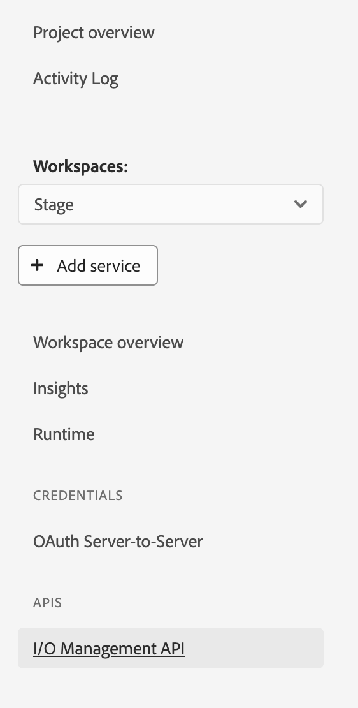
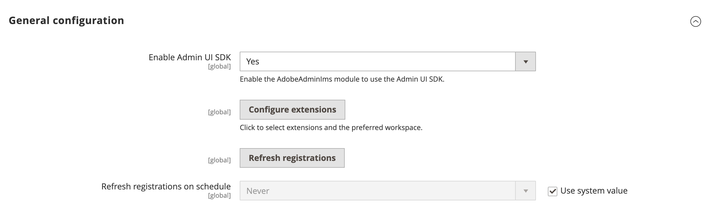
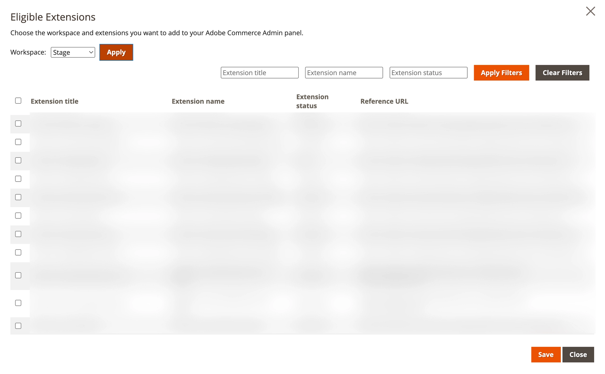
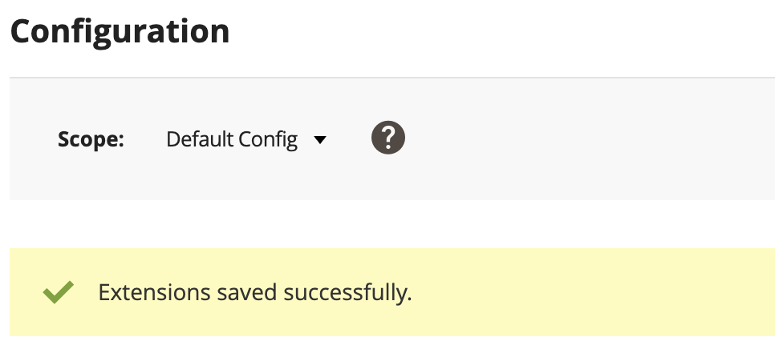
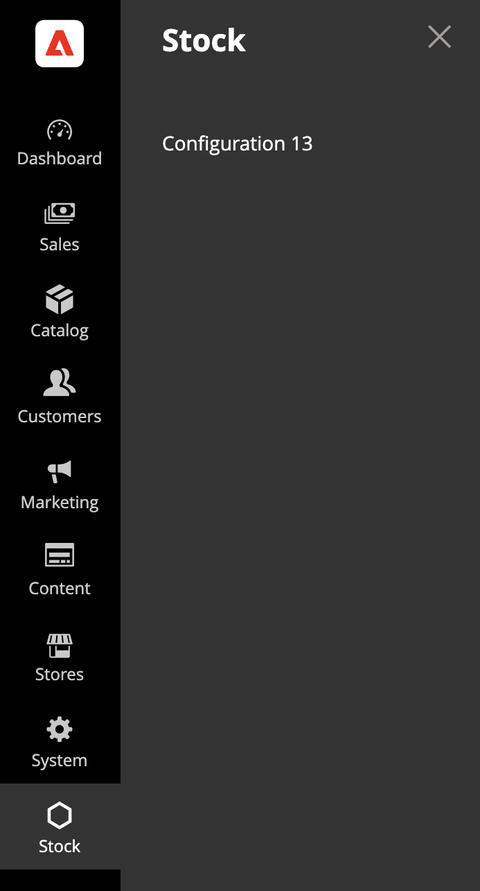

# Admin UI SDK Lab | EMEA Partner Days 2025

- [Objective](#objective)
- [Problem Statement](#problem-statement)
- [Helpful resources](#helpful-resources)
- [Step-by-Step instructions](#step-by-step-instructions)
  - [Step 1: Configuration files](#step-1-configuration-files)
  - [Step 2: Migrate from application to extension](#step-2-migrate-from-application-to-extension)
  - [Step 3: Register the menu extension point](#step-3-register-the-menu-extension-point)
  - [Step 4: Deploy the extension to the Stage workspace](#step-4-deploy-the-extension-to-the-stage-workspace)
  - [Step 5: Configure the Adobe Commerce Admin Panel](#step-5-configure-the-adobe-commerce-admin-panel)
  - [Step 6: Test the integration](#step-6-test-the-integration)
  - [Step 7: Add the configuration component](#step-7-add-the-configuration-component)
- [Troubleshooting](#troubleshooting)

## Objective

This lab provides hands-on experience with the Adobe Commerce Admin UI SDK by integrating a single-page application (SPA) into the Admin Panel interface, entirely through JavaScript; without requiring any PHP code.

## Problem statement

The single-page application (SPA) includes a configuration toggle that enables or disables stock validation rules, along with a parameter defining the maximum quantity allowed per item in an order. These settings are securely persisted in App Builder’s lib-files storage and retrieved at runtime to dynamically control webhook execution behavior.

## Helpful resources

- Most of required files are located in the `lab/admin-ui-sdk` folder to streamline setup and avoid time spent on boilerplate creation.
- [Admin UI SDK documentation](https://developer.adobe.com/commerce/extensibility/admin-ui-sdk/)
- [Adobe App Builder Extensions documentation](https://developer.adobe.com/app-builder/docs/guides/app_builder_guides/extensions/extensions/)

## Step-by-Step instructions

### Step 1: Configuration files

1. Create the `install.yaml` file

    Place this file at the root of your project. Ensure it correctly targets the `commerce/backend-ui/1` extension point ID to register your application with the Adobe Commerce Admin Panel.

    > A sample file is available in the `lab/admin-ui-sdk` folder.

2. Create the `extension-manifest.json` file

    Also located at the root of your project, this file must define the `platform` as `"web"` and include a unique `id` for your extension. You can append the existing id with your seat number.

    > A sample file is provided in the `lab/admin-ui-sdk` folder.

### Step 2: Migrate from application to extension

1. Create a new `src/commerce-backend-ui-1` folder.

2. Move the `actions` folder under `src/commerce-backend-ui-1`.

3. Move the `web-src` folder under `src/commerce-backend-ui-1`.

4. Move the `utils` folder under `src/commerce-backend-ui-1`.

5. Update the `src/commerce-backend-ui-1/actions/starter-kit-info/index.js` file to reference the correct path for the `version` and `registrations` on lines 27 and 28:

    ```javascript
    const version = require('../../../../package.json').version
    const registrations = require('../../../../scripts/onboarding/config/starter-kit-registrations.json')
    ```

6. Update the `src/commerce-backend-ui-1/utils/naming.js` file to reference the correct path for the `providersList` on line 71:

    ```javascript
    const providersList = require('../../../scripts/onboarding/config/providers.json')
    ```

7. Create an `ext.config.yaml` file under `src/commerce-backend-ui-1` folder.

8. Copy the content under `application` from `app.config.yaml` file and paste it into `src/commerce-backend-ui-1/ext.config.yaml`. Adjust indentation to remove empty space before `actions`.

9. Append the `src/commerce-backend-ui-1/ext.config.yaml` to start with:

    ```yaml
    operations:
       view:
          - type: web
            impl: index.html
    ```

10. Append the `src/commerce-backend-ui-1/ext.config.yaml` with `web-src` below `actions` line:

    ```yaml
    web: web-src
    ```

    > A sample file `ext.config.yaml` is provided in the `lab/admin-ui-sdk/migration` folder.

11. Replace the `application` line in `app.config.yaml` with the following:

    ```yaml
    extensions:
       commerce/backend-ui/1:
          $include: src/commerce-backend-ui-1/ext.config.yaml
    ```

    > A sample file `app.config.yaml` is provided in the `lab/admin-ui-sdk/migration` folder.

12. Run `aio app build --force-build` to make sure compilation is successful.

### Step 3: Register the menu extension point

1. Create the registration runtime action

    - Append the `ext.config.yaml` file to add the `admin-ui-sdk` package with a `registration` runtime action under `actions`.

        ```yaml
        admin-ui-sdk:
           license: Apache-2.0
           actions:
              registration:
                  function: actions/registration/index.js
                  web: 'yes'
                  runtime: 'nodejs:20'
                  inputs:
                     LOG_LEVEL: debug
                  annotations:
                     require-adobe-auth: true
                     final: true
        ```

    - Create the `registration/index.js` file under `actions` folder.

        > A sample file is provided in the `lab/admin-ui-sdk/registration` folder.

    - Open the `registration/index.js` and update the `seatNumber` constant with your assigned seat.

2. Create the ExtensionRegistration component

    The ExtensionRegistration component allows to register the application using the `adobe/uix-sdk`.

    Create the component under `web-src/src/components`.

    > A sample file `extension-registration.jsx` is provided in the `lab/admin-ui-sdk` folder.

3. Update the return component in the `extension-registration.jsx` file to return the home page.

    ```javascript
    return <Home ims={props.ims} runtime={props.runtime} />
    ```

4. Update the extension routing in the `web-src/src/app.jsx` file to reference `ExtensionRegistration` component on line 26:

    ```javascript
    const routes = [
        {
        path: "/",
        pageComponent: <ExtensionRegistration ims={props.ims} runtime={props.runtime} />,
        },
    ];
    ```

5. Run `aio app build --force-build` to make sure complitation is successful for 6 runtime actions.

### Step 4: Deploy the extension to the Stage workspace

1. Verify the selected project & workspace by running the following command:

    `aio console where`

    Response example:

    ```bash
    You are currently in:
    1. Org: <your-org>
    2. Project: <your-project>
    3. Workspace: Stage
    ```

2. If one of the values is incorrect refer to [following troubleshooting point](#3-selected-org-project-or-workspace-are-incorrect).

3. Open the developer console, go to your project, select the Stage workspace and make sure the `I/O Management API` is added. If not, click on `Add Service`, select `API` and select the `I/O Management API`.

    

4. In your project terminal, run the following command:

    `aio app use --merge`

    > Make sure the selected org, project and workspace are correct. This step will create the `.env` and `.aio` files.

    Response example:

    ```bash
    A. Use the global Org / Project / Workspace configuration:
        1. Org: <your-org>
        2. Project: <your-project>
        3. Workspace: Stage
    B. Switch to another Workspace in the current Project
    ```

5. Build and deploy the extension using:

    `aio app deploy --force-build --force-deploy`

    You'll see that the project is now deployed to a new extension point:

    ```bash
    New Extension Point(s) in Workspace 'Stage': 'commerce/backend-ui/1'
    ```

### Step 5: Configure the Adobe Commerce Admin Panel

1. Go the Adobe Commerce Admin Panel.

2. Navigate to Stores > Settings > Configuration > Adobe Services > Admin UI SDK.

    

3. Enable the Admin UI SDK.

4. Save the configuration, by clicking on the `Save Config` button.

5. Click on `Configure extensions` button.

    

6. Check that the selected workspace is the correct one (Stage).

7. Search for the name of your application and select it.

8. Click on Save and wait till you get a notification with the following message: "Extensions saved successfully."

    

### Step 6: Test the integration

1. In the menu, a new section `EMEA Partner Days` is created.

2. Click on the menu and find your application `Configuration`.

    

3. Open the menu, it'll load your application from App Builder.

### Step 7: Add the configuration component

1. Create the `Config` component under `web-src/src/components`.

    > A sample file `config.jsx` is provided in the `lab/admin-ui-sdk` folder.

2. Copy the `utils.js` file from `lab/admin-ui-sdk` folder and add it under `web-src/src`. This files contains helpers to call runtime actions in the `config.jsx` file.

3. Create the `save-config` runtime action in the `actions/data/actions.config.yaml` file.

    ```yaml
    save-config:
      function: stock/saveConfig.js
      web: 'yes'
      runtime: 'nodejs:20'
      inputs:
        LOG_LEVEL: debug
      annotations:
        require-adobe-auth: false
        final: true
    ```

4. Create `saveConfig.js` file for the runtime action under `actions/data/stock`.

    > A sample file `saveConfig.js` is provided in the `lab/admin-ui-sdk/data` folder.

5. Update the `data/stock/getConfig.js` file to load configuration from the `filesLib`.

    ```javascript
    const files = await filesLib.init()
    const stockValidationFile = await files.list('config/stock-validation.json')
    if (stockValidationFile.length) {
        let buffer = await files.read('config/stock-validation.json')
        stockValidationConfig = JSON.parse(buffer.toString())
    }
    ```

    Don't forget the require part:

    ```javascript
    const filesLib = require('@adobe/aio-lib-files')
    ```

    And update the default value to remove hardcoded config and transform the constant into a variable:

    ```javascript
    let stockValidationConfig = {
        maxAmount: 0,
        enableStockValidation: false
    }
    ```

    > A sample file `getConfig.js` is provided in the `lab/admin-ui-sdk/data` folder.

6. Update the `home.jsx` file to include the `Config` component. Here's a suggested layout:

    ```javascript
    return (
        <View height="100%" overflow="auto">
        <Flex direction="row" gap="size-200">
            <View width={'50%'}>
                <Flex direction="column" gap="size-200">
                    <LatestOrdersCard
                    setOrderIds={setOrderIds}
                    ims={props.ims}
                    />
                    <ShipOrderCard
                    orderIds={orderIds}
                    setOrderIds={setOrderIds}
                    ims={props.ims}
                    />
                </Flex>
            </View>
            <View width={'50%'}>
                <Config ims={props.ims} />
            </View>
        </Flex>
        </View>
    );
    ```

7. Build and deploy the extension using:

    `aio app deploy --force-build --force-deploy`

8. Refresh the Admin panel page and you'll see the changes with the config component.

9. You can now change the configuration values, save it and test the webhook.

## Troubleshooting

### 1. Application is not found in the `Configure extensions` screen

- Check that the selected workspace is the correct one, and click on `Apply` button to reload all applications.

- Make sure you deployed your changes to the correct workspace. You can run `aio console where` for more details on the selected org, project and workspace.

- Check your `.env` file is updated and pointing to the correct project and workspace. If not, run `aio app use`, then deploy again `aio app deploy --force-build --force-deploy`.

- If none of the above steps are woking, please reach out to an available technical assistant for help.

### 2. Menu is not appearing in the Adobe Commerce Admin Panel

- Check that the application is selected in the `Configure extensions` screen.

- Go to Stores > Settings > Configuration > Adobe Services > Admin UI SDK, and in the general configuration section click on `Refresh registrations` button. Once you get a banner notification confirming registrations are refreshed successfully, check your menu.

- If none of the above steps are woking, please reach out to an available technical assistant for help.

### 3. Selected org, project or workspace are incorrect

- If the selected org is not the correct one, select the org using:

    `aio console org select`

  - If the org is not found in the list, logout using `aio auth logout` and login using `aio auth login`. Then run `aio console org select`.

  - If you're still not finding the correct org, logout with `aio auth logout` and force login using `aio auth login -f`. Then run `aio console org select`.

- If the selected project is not the correct one, select the project using:

    `aio console project select`

- If the selected workspace is not the correct one, select the workspace using:

    `aio console workspace select`

- If none of the above steps are woking, please reach out to an available technical assistant for help.

### 4. Error on `config.json` when running the build

- If you experience the followin error when running `aio app build`:

```bash
✖ Building web assets for 'commerce/backend-ui/1'
 ›   Error: Failed to resolve '../config.json' from './src/commerce-backend-ui-1/web-src/src/hooks/use-web-action.js'
```

- Make sure there's a `config.json` file under `src/commerce-backend-ui-1/web-src/src` directory.

- If the file doesn't exist, create it with a an empty JSON

    ```json
    {}
    ```

- If it's still failing, please reach out to an available technical assistant for help.
