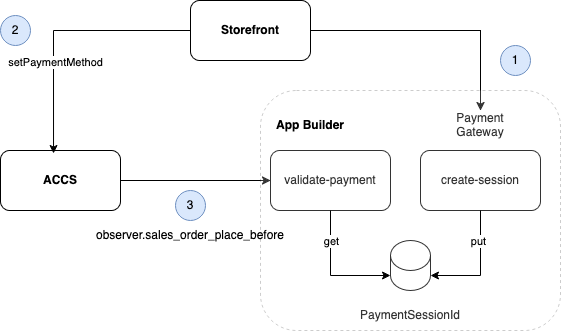

# Commerce Partner Days - Storefront Drop-ins Lab

---

## Table of Contents
- [Overview](#overview)
- [Prerequisites](#prerequisites)
- [What You'll Learn](#what-youll-learn)
- [Links](#links)
- [Exercise 1: Enhanced Cart Experience](#exercise-1-enhanced-cart-experience)
- [Exercise 2: Payment Method Integration](#exercise-2-payment-method-integration)
  - [Part I: Create Payment Method](#part-i-create-payment-method)
  - [Part II: Add Payment Method Logic](#part-ii-add-payment-method-logic)
  - [Part III: Storefront Integration](#part-iii-storefront-integration)

---

## Overview
This lab consists of two main exercises that will help you understand and implement key features in Adobe Commerce storefront:

1. **Enhanced Cart Experience**: A smaller exercise that demonstrates how to add visual category indicators to cart items
2. **Payment Method Integration**: A comprehensive exercise that guides you through creating and integrating a custom OOPE (Out-of-Process Extension) payment method

---

## Prerequisites
Before starting this lab, you must have completed the Commerce Partner Days - ACCS Session. This ensures you have:
- A ready-to-use lab codespace
- A configured storefront codespace
- An App Builder project set up with the necessary permissions

---

## What You'll Learn
- How to extend storefront drop-ins with slots
- How to create and configure a custom payment method in Adobe Commerce
- How to set up webhook subscriptions for payment validation
- How to integrate payment method logic into the storefront checkout drop-in

---

## Links
After scaffolding your storefront, you'll have access to these URLs:

| Resource | URL |
|----------|-----|
| Storefront Preview | `https://main--<REPO>--<OWNER>.aem.page/` |
| Content Editor | `https://da.live/#/<OWNER>/<REPO>` |
| Configuration Manager | `https://da.live/#/<OWNER>/<REPO>/configs-stage` |
| Admin URL | `https://na1-sandbox.admin.commerce.adobe.com/<TENANT_ID>` |
| REST Endpoint | `https://na1-sandbox.api.commerce.adobe.com/<TENANT_ID>` |

---

## Exercise 1: Enhanced Cart Experience

In this exercise, we'll enhance the shopping cart experience by adding visual category indicators to cart items. Each product's categories will be displayed as badges with corresponding icons.

### Step 1: Enable Slot Visualization

1. Open your storefront codespace
2. Navigate to the terminal
3. Start the development server:
   ```bash
   yarn start
   ```
4. Open your browser, add a product to the cart and go to the cart page
5. Open browser developer tools (right-click > Inspect)
6. In the console tab, run:
   ```javascript
   DROPINS.showSlots(true)
   ```
7. You should now see highlighted areas on the cart page where you can inject custom content
6. In the console tab, run this to disable it:
   ```javascript
   DROPINS.showSlots(false)
   ```

### Step 2: Add Product Categories to Cart

1. Open the cart block file in your storefront codespace:
   ```bash
   blocks/commerce-cart/commerce-cart.js
   ```

2. Locate the `enableRemoveItem` prop (around line 82). Below this line, you'll add a new `slots` configuration that will display product categories as badges with icons.

3. Add the following code snippet exactly as shown below:

```javascript
slots: {
    ProductAttributes: (ctx) => {
        const productAttributes = document.createElement('div');
        productAttributes.className = 'product-attributes';

        // Create categories section
        if (ctx.item && ctx.item.categories && ctx.item.categories.length > 0) {
        const categoryIcons = {
            'All': '🌍',
            'Office': '📁',
            'Apparel': '👕',
            'Bags': '🎒',
            'Collections': '🖼️',
            'Lifestyle': '🌟',
            'Tech': '💻',
            'Gifts': '🎁',
            'Travel': '✈️'
        };

        const categoryElements = ctx.item.categories.map(category => {
            const categoryName = category;
            const categoryIcon = categoryIcons[categoryName] || '🌍';
            return `<div class="product-attribute-category">${categoryIcon} ${categoryName}</div>`;
        });

        productAttributes.innerHTML = categoryElements.join('');

        // Add some basic styles
        const style = document.createElement('style');
        style.textContent = `
            .product-attributes {
            padding: 10px;
            margin: 10px 0;
            }
            .product-attribute-category {
            display: inline-block;
            margin: 5px;
            padding: 5px 10px;
            background: #f5f5f5;
            border-radius: 15px;
            font-size: 0.9em;
            }
        `;
        productAttributes.appendChild(style);
        }

        ctx.appendChild(productAttributes);
    },
}
```

### Step 3: Test the Enhanced Cart

1. Refresh your cart page
2. Add different products to your cart
3. Verify that:
   - Category badges appear with icons
   - Badges are properly styled
   - Content is properly aligned and spaced

---

## Exercise 2: Payment Method Integration

In this exercise, we'll implement a custom payment method called "PARTNER-PAY" using Adobe App Builder.

Here's the simplified integration flow:



When a user clicks the place order button:
1. The storefront checkout will create a session on the payment gateway (simulated with the App Builder runtime action `payment-method/create-session`). This will generate a random UUID simulating the payment session identifier and return it to the storefront.
2. The storefront will set the payment method to PARTNER-PAY with the payment session ID returned by `payment-method/create-session`.
3. ACCS will trigger the webhook `payment-method/validate-payment` on the event `observer.sales_order_place_before`.


### Lab Structure
The exercise is divided into three main parts:

1. **Part I**: Create payment method (ACCS)
2. **Part II**: Add payment method logic (App Builder)
3. **Part III**: Storefront integration (EDS Storefront)

---

## Part I: Create Payment Method

### Step 1.1: Set Up Environment Variables
1. Open your partner-day-accs codespace
2. Open the terminal
3. Set your REST API endpoint (replace `<TENANT_ID>` with the tenant ID for your assigned seat)

```bash
export REST_API=https://na1-sandbox.api.commerce.adobe.com/<TENANT_ID>
```

### Step 1.2: Generate and Set Access Token
1. Navigate back to the Adobe Developer Console at https://developer.adobe.com/console/. If prompted, login and select the **Adobe Commerce Labs** organization.
2. Click **Projects** in the Developer Console top menu.

    

3. Select the project assigned to your seat:
   **PD SY <SEAT_NUMBER>**
4. Select the **Stage** workspace
5. Navigate to Credentials > OAuth Server-to-Server section
6. Click on "Generate access token" button
7. Copy the generated token
8. Set the token in your terminal:

```bash
export ACCESS_TOKEN="paste here"
```

### Step 1.3: Verify Existing Payment Methods
1. Run the following command to check current payment methods:

```bash
curl -s \
  -H "Authorization: Bearer $ACCESS_TOKEN" \
  $REST_API/V1/oope_payment_method | jq .
```

2. Review the output to ensure "PARTNER-PAY" is not already in the list

### Step 1.4: Create New Payment Method
1. Create a new payment method by running:

```bash
PAYMENT_METHOD_JSON='{
  "payment_method": {
    "code": "PARTNER-PAY",
    "title": "PARTNER PAY",
    "active": true
  }
}'

curl -XPOST \
  -s -H "Authorization: Bearer $ACCESS_TOKEN" \
  -H 'Content-type: application/json' \
  -d "$PAYMENT_METHOD_JSON" \
  $REST_API/V1/oope_payment_method | jq .
```

### Step 1.5: Verify Payment Method Creation
1. Run the verification command again:

```bash
curl -s \
  -H "Authorization: Bearer $ACCESS_TOKEN" \
  $REST_API/V1/oope_payment_method | jq .
```

2. Confirm that "PARTNER-PAY" appears in the list of payment methods

### Step 1.6: Test in Storefront
1. Navigate to your storefront preview URL: `https://main--<REPO>--<OWNER>.aem.page/`
2. Add items to your cart
3. Proceed to checkout
4. Verify that "PARTNER-PAY" appears in the list of available payment methods

---

## Part II: Add Payment Method Logic

In this section, you'll connect your new payment method to backend logic using Adobe App Builder. This ensures that the payment method is validated before an order is placed.

---

### Step 2.1: Enable Payment Method Logic in App Builder

1. **Open your App Builder project** (in your codespace or local environment).
2. Locate the `app.config.yaml` file in the root of your App Builder project.
3. Find the section for the payment method logic (it may be commented out).
4. **Uncomment** the relevant block for `payment-method` so it is enabled.
5. **Deploy your changes** to App Builder by running:
   ```bash
   aio app deploy --force-build --force-deploy
   ```
6. After deployment, run:
   ```bash
   aio app get-url
   ```
   - Confirm that both the following endpoints are listed:
     - `payment-method/create-session`
     - `payment-method/validate-payment`
   - **Note:** You will need the URL for `validate-payment` in the next step.

---

### Step 2.2: Subscribe to the Webhook

1. In your terminal, set up the webhook subscription by running:
   - Replace `https://<your-validate-payment-endpoint-url>` with the actual URL from your deployed App Builder action (from Step 2.1).
   ```bash

   VALIDATE_PAYMENT_URL="https://<your-validate-payment-endpoint-url>"

   WEBHOOK_JSON='
   {
     "webhook": {
       "webhook_method": "observer.sales_order_place_before",
       "webhook_type": "before",
       "batch_name": "validate_payment",
       "hook_name": "oope_payment_methods_sales_order_place_before",
       "url": "'$VALIDATE_PAYMENT_URL'",
       "required": true,
       "method": "POST",
       "fields": [
         {"name": "payment_method", "source": "data.order.payment.method"},
         {"name": "payment_additional_information", "source": "data.order.payment.additional_information"}
       ],
       "rules": [
         {"field": "data.order.payment.method", "operator": "equal", "value": "PARTNER-PAY"}
       ]
     }
   }'

   curl -s -X POST $REST_API/V1/webhooks/subscribe \
     -H "Authorization: Bearer $ACCESS_TOKEN" \
     -H "Content-Type: application/json" \
     -d "$WEBHOOK_JSON" | jq .
   ```


---

### Step 2.3: Verify Webhook Subscription in Admin

1. Log in to the Admin Panel:
   `https://na1-sandbox.admin.commerce.adobe.com/<TENANT_ID>`
2. Go to **System > Webhooks > Webhooks Subscriptions**.
3. You should see your new webhook listed. Click "Select" to view its details.
4. Confirm the following settings:

   **Hook Settings**
   | Setting         | Value                                               |
   |-----------------|-----------------------------------------------------|
   | Webhook Method  | `observer.sales_order_place_before`                 |
   | Webhook Type    | `before`                                            |
   | Batch Name      | `validate_payment`                                  |
   | Hook Name       | `oope_payment_methods_sales_order_place_before`     |
   | URL             | `https://<your-validate-payment-endpoint-url>`      |
   | Active          | `Yes`                                               |
   | Method          | `POST`                                              |

   **Hook Fields**
   | Field Name                  | Source                                   |
   |-----------------------------|------------------------------------------|
   | payment_method              | data.order.payment.method                |
   | payment_additional_information | data.order.payment.additional_information |

   **Hook Rules**
   | Field                        | Operator | Value         |
   |------------------------------|----------|--------------|
   | data.order.payment.method    | equal    | PARTNER-PAY  |

---

### Step 2.4: Test Payment Validation

1. Go to your storefront checkout page.
2. Try to place an order using the "PARTNER-PAY" payment method.
3. You should see an error message:
   **"Invalid payment session"**
4. This confirms that your webhook is active and the validation logic is working.

---

**Tips:**
- If you do not see the webhook in the Admin Panel, double-check your `WEBHOOK_JSON` and ensure the correct endpoint URL is used.
- If the error message does not appear, check the logs for your App Builder action and ensure it is deployed and accessible.

---

## Part III: Storefront Integration

### Step 3.1: UI Render
1. Go to the storefront repository
2. Open the block `blocks/commerce-checkout/commerce-checkout.js`
3. In Line 339, add the following code to render a warning message when the payment method is selected:

```javascript
"PARTNER-PAY": {
    render: (ctx) => {
        const $content = document.createElement('div');
        $content.innerHTML = `
        <div class="payment-method-card">
            <div class="payment-method-card__message">
            <p>This is a test payment method for demonstration purposes only.</p>
            </div>
        </div>
        `;
        ctx.replaceHTML($content);
    },
},
```

4. Run `yarn start` to start the storefront
5. Select PARTNER-PAY payment method. It should display a warning message below the payment methods.

### Step 3.2: UI Styling
1. Open the CSS file of the commerce-checkout block `blocks/commerce-checkout/commerce-checkout.css`
2. Append the following CSS rules to the end of the file:

```css
/* Payment Method Card */
.checkout__payment-methods .payment-method-card {
    border: 1px solid var(--color-neutral-300);
    border-radius: var(--shape-border-radius-medium);
    padding: var(--spacing-medium);
    margin-top: var(--spacing-small);
}

.payment-method-card {
    background-color: var(--color-neutral-50);
    border-radius: var(--shape-border-radius-medium);
    padding: var(--spacing-medium);
}

.payment-method-card__message {
    font: var(--type-body-2-default-font);
    color: var(--color-neutral-700);
}

.payment-method-card__warning {
    color: var(--color-error-600);
    font-weight: 500;
    margin-top: var(--spacing-small);
}
```

3. Go back to the browser and re-load the checkout page. It should display the message in a styled box.

### Step 3.3: Payment Logic
1. In Line 470, before `// place order`, add the following code to create the session and set the payment session identifier:

```javascript
// Add payment session creation for PARTNER-PAY
if (code === "PARTNER-PAY") {
    const PAYMENT_SESSION_API = '<payment-method/validate-session>'; // (use the URL from Step 7)

    try {
        const response = await fetch(PAYMENT_SESSION_API);
        const responseData = await response.json();
        const paymentSessionId = responseData?.message?.paymentSessionId;

        if (!paymentSessionId) {
            throw new Error('Unable to process payment at this time. Please try again later.');
        }

        await checkoutApi.setPaymentMethod({
            code: 'PARTNER-PAY',
            additional_data: [
                {
                    key: 'paymentSessionId',
                    value: paymentSessionId,
                },
            ],
        });
    } catch (error) {
        console.error('Payment session creation failed:', error);
        throw new Error('Payment processing failed. Please try again.');
    }
}
```

2. Place an order with PARTNER-PAY payment method. Now it should work.

---

